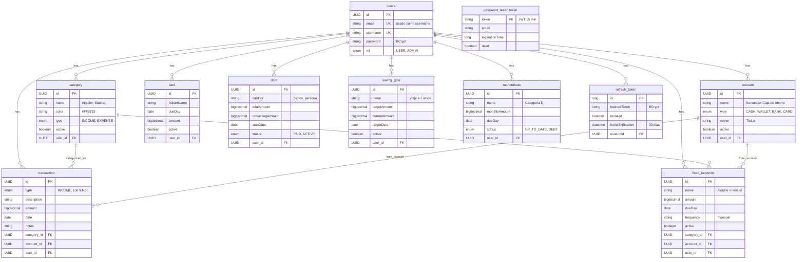

# FinTrack — Documentación Técnica

## Índice

1. [Visión General](#visión-general)
2. [Arquitectura](#arquitectura)
3. [Modelo de Datos](#modelo-de-datos)
4. [Qué Representa Cada Entidad](#qué-representa-cada-entidad)
5. [Diagrama Entidad-Relación](#diagrama-entidad-relación)
6. [Sistema de Autenticación](#sistema-de-autenticación)
7. [Manejo de Errores](#manejo-de-errores)
8. [Estado Actual del Proyecto](#estado-actual-del-proyecto)
9. [Endpoints de la API](#endpoints-de-la-api)
10. [Cómo Ejecutar](#cómo-ejecutar)

---

## Visión General

FinTrack es una aplicación de finanzas personales con las siguientes capas:

```
PostgreSQL ← Java Spring Boot (REST API) ←┬─ Next.js Frontend (Web App)
                                           └─ Node.js MCP Server ←┬─ Telegram Bot
                                                                   └─ Ollama (IA Local)
```

**Stack:** Java 21, Spring Boot 4.0.1, Spring Data JPA, Spring Security, JWT, PostgreSQL, Maven.

---

## Arquitectura

### Estructura del Backend

```
src/main/java/com/valencmz/fintrack/
├── FintrackApplication.java       # Punto de entrada
├── config/                         # Configuración
│   ├── SecurityConfig.java         # Spring Security, CORS, JWT filter
│   ├── JwtFilter.java              # Filtro de autenticación JWT
│   └── GlobalExceptionHandler.java # Manejo centralizado de errores
├── controller/                     # Controladores REST
│   └── AuthController.java         # Auth (login, register, refresh, reset password)
├── enums/                          # Enumeraciones
│   ├── AccountType.java            # CASH, WALLET, BANK, CARD
│   ├── CategoryType.java           # INCOME, EXPENSE
│   ├── TransactionType.java        # INCOME, EXPENSE
│   ├── DebtStatus.java             # PAID, ACTIVE
│   ├── MonotributoStatus.java      # UP_TO_DATE, DEBT
│   └── Rol.java                    # USER, ADMIN
├── errors/                         # Manejo de errores
│   ├── ApiResponse.java            # Envelope genérico de respuesta
│   ├── ErrorResponse.java          # Respuesta de error con status HTTP
│   ├── Result.java                 # Pattern Result para services
│   └── CustomAppException.java     # Excepción de negocio
├── model/
│   ├── entity/                     # Entidades JPA (11)
│   │   ├── User.java               # Usuario
│   │   ├── Account.java            # Cuenta bancaria/digital
│   │   ├── Category.java           # Categoría de ingresos/gastos
│   │   ├── Transaction.java        # Transacción financiera
│   │   ├── FixedExpende.java       # Gasto fijo mensual
│   │   ├── Card.java               # Tarjeta de crédito
│   │   ├── Debt.java               # Deuda
│   │   ├── SavingGoal.java         # Meta de ahorro
│   │   ├── Monotributo.java        # Pago de monotributo
│   │   ├── RefreshToken.java       # Token de refresco (auth)
│   │   └── auth/
│   │       ├── UserAuth.java       # Adaptador UserDetails
│   │       └── PasswordResetToken.java # Token de reset de contraseña
│   └── dto/                        # Data Transfer Objects (28 archivos)
│       ├── auth/                   # LoginDTO, RegisterDTO, etc.
│       ├── account/                # AccountRequest, AccountResponse
│       ├── card/                   # CardRequest, CardResponse
│       ├── category/               # CategoryRequest, CategoryResponse
│       ├── debt/                   # DebtRequest, DebtResponse
│       ├── fixedexpense/           # FixedExpendeRequest, FixedExpendeResponse
│       ├── monotributo/            # MonotributoRequest, MonotributoResponse
│       ├── savinggoal/             # SavingGoalRequest, SavingGoalResponse
│       ├── transaction/            # TransactionRequest, TransactionResponse
│       └── user/                   # UserDTO, UserResponse, UsuarioUpdateDTO
├── repository/                     # Repositorios JPA (11)
│   ├── UserRepository.java
│   ├── AccountRepository.java
│   ├── CategoryRepository.java
│   ├── TransactionRepository.java
│   ├── FixedExpendeRepository.java
│   ├── CardRepository.java
│   ├── DebtRepository.java
│   ├── SavingGoalRepository.java
│   ├── MonotributoRepository.java
│   ├── RefreshTokenRepository.java
│   └── PasswordResetTokenRepository.java
└── service/                        # Servicios (5)
    ├── UsuarioService.java         # Auth + gestión de usuarios
    ├── UsuarioDetailService.java   # UserDetailsService para Spring Security
    ├── JwtService.java             # Generación y validación de JWT
    ├── EmailService.java           # Envío de emails (async)
    └── AccountService.java         # Account (en progreso)
```

---

## Modelo de Datos

### Esquema de la Base de Datos

- **Base de datos:** `fintrackdb`
- **ORM:** Hibernate 7.2
- **Dialect:** PostgreSQL
- **Estrategia DDL:** `update` (Hibernate genera/actualiza las tablas automáticamente)

### Enumeraciones (Enums)

| Enum | Valores |
|------|--------|
| `AccountType` | `CASH`, `WALLET`, `BANK`, `CARD` |
| `CategoryType` | `INCOME`, `EXPENSE` |
| `TransactionType` | `INCOME`, `EXPENSE` |
| `DebtStatus` | `PAID`, `ACTIVE` |
| `MonotributoStatus` | `UP_TO_DATE`, `DEBT` |
| `Rol` | `USER`, `ADMIN` |

---

## Qué Representa Cada Entidad

### `User` → tabla `users`
El usuario de la aplicación. Tiene email (usado como username para login), nombre de usuario, contraseña encriptada con BCrypt, y un rol (`USER` o `ADMIN`). Es la entidad raíz: todo pertenece a un usuario.

### `Account` → tabla `account`
Representa una **cuenta financiera** del usuario — dónde tiene la plata.

| Campo | Descripción |
|-------|-------------|
| `name` | Nombre descriptivo ("Santander Caja de Ahorro") |
| `type` | `CASH` (efectivo), `WALLET` (Mercado Pago), `BANK` (banco), `CARD` (tarjeta) |
| `owner` | Titular de la cuenta |
| `active` | Si está en uso o fue desactivada |

**Ejemplos:** "Billetera" (CASH), "Mercado Pago" (WALLET), "Santander Caja de Ahorro" (BANK).

### `Category` → tabla `category`
Clasifica las transacciones y gastos fijos.

| Campo | Descripción |
|-------|-------------|
| `name` | Nombre ("Supermercado", "Sueldo") |
| `color` | Color hex para el frontend ("#FF5733") |
| `type` | `INCOME` (ingreso) o `EXPENSE` (egreso) |
| `active` | Si está en uso |

**Ejemplos:** "Sueldo" (INCOME), "Alquiler" (EXPENSE), "Supermercado" (EXPENSE).

### `Transaction` → tabla `transaction`
Registra cada **movimiento de dinero** — un ingreso o un gasto puntual.

| Campo | Descripción |
|-------|-------------|
| `type` | `INCOME` o `EXPENSE` |
| `description` | Descripción ("Compra supermercado") |
| `amount` | Monto en pesos |
| `date` | Fecha de la transacción |
| `notes` | Notas opcionales |
| `category` | FK a `category` — de qué categoría es |
| `account` | FK a `account` — de qué cuenta salió/entró |

**Ejemplo:** "Cobré el sueldo" → `INCOME`, $500.000, categoría "Sueldo", cuenta "Santander".

### `FixedExpende` → tabla `fixed_expende`
Gasto que se repite periódicamente (alquiler, internet, suscripciones).

| Campo | Descripción |
|-------|-------------|
| `name` | Nombre ("Alquiler", "Netflix") |
| `amount` | Monto |
| `dueDay` | Día de vencimiento |
| `frequency` | Frecuencia (mensual, anual) — opcional |
| `active` | Si está activo |
| `category` | FK a `category` |
| `account` | FK a `account` |

**Ejemplo:** "Alquiler" → $200.000, vence el 5 de cada mes, categoría "Vivienda", cuenta "Galicia".

### `Card` → tabla `card`
Tarjeta de crédito con sus datos de vencimiento.

| Campo | Descripción |
|-------|-------------|
| `holderName` | Nombre del titular |
| `dueDay` | Día de vencimiento |
| `amount` | Monto actual a pagar |
| `active` | Si está en uso |

**Ejemplo:** "Visa Santander" → vence el 15, $45.000 a pagar.

### `Debt` → tabla `debt`
Deuda a pagar (préstamo, cuotas, etc.).

| Campo | Descripción |
|-------|-------------|
| `creditor` | Acreedor ("Banco X") |
| `totalAmount` | Monto total de la deuda |
| `remainingAmount` | Cuánto falta pagar |
| `startDate` | Fecha de inicio |
| `status` | `PAID` (pagada) o `ACTIVE` (activa) |

**Ejemplo:** "Préstamo personal" → $300.000 total, $150.000 pendiente, acreedor "Banco Nación".

### `SavingGoal` → tabla `saving_goal`
Meta de ahorro con seguimiento de progreso.

| Campo | Descripción |
|-------|-------------|
| `name` | Nombre ("Viaje a Europa") |
| `targetAmount` | Monto objetivo |
| `currentAmount` | Monto ahorrado hasta ahora |
| `targetDate` | Fecha objetivo |
| `active` | Si está activa |

**Ejemplo:** "Viaje" → objetivo $2.000.000, ahorrado $500.000, fecha: diciembre 2026.

### `Monotributo` → tabla `monotributo`
Registro de pago de monotributo para trabajadores autónomos.

| Campo | Descripción |
|-------|-------------|
| `name` | Categoría o nombre ("Categoría D") |
| `monthlyAmount` | Monto mensual a pagar |
| `dueDay` | Día de vencimiento |
| `status` | `UP_TO_DATE` (al día) o `DEBT` (con deuda) |

**Ejemplo:** "Monotributo Cat. D" → $8.500, vence el 20, status `UP_TO_DATE`.

### `RefreshToken` → tabla `refresh_token`
Token de refresco para JWT. Se genera al hacer login y permite renovar el access token sin volver a pedir contraseña.

| Campo | Descripción |
|-------|-------------|
| `hashedToken` | Token encriptado con BCrypt |
| `revoked` | Si fue revocado |
| `fechaExpiracion` | Vence a los 30 días |
| `user` | FK a `users` |

### `PasswordResetToken` → tabla `password_reset_token`
Token JWT de un solo uso para resetear la contraseña. Vence a los 15 minutos.

| Campo | Descripción |
|-------|-------------|
| `token` | JWT (PK) |
| `email` | Email del usuario |
| `expirationTime` | Timestamp de expiración |
| `used` | Si ya fue usado |

---

## Diagrama Entidad-Relación



---

## Sistema de Autenticación

### Flujo de Auth

```
Register → Login → Access Token (JWT, 1h) + Refresh Token (cookie, 30d)
                       ↓ expira
                Refresh Token → Nuevo Access Token + Nuevo Refresh Token
```

### JWT
- **Access Token:** JWT firmado con HMAC-SHA256, expira 1 hora, contiene `sub=email` y claim `rol`
- **Refresh Token:** 32 bytes aleatorios, BCrypt hasheado en BD, se envía como cookie HttpOnly
- **Reset Token:** JWT de 15 minutos para resetear contraseña

### Seguridad
- `SecurityConfig` desactiva CSRF (API stateless)
- Sesiones: `STATELESS`
- CORS: permite `http://localhost:3000`
- Password encoder: BCrypt
- Filtro `JwtFilter` en cada request protegido
- Rutas públicas: `/auth/**`, `/swagger-ui/**`, `/v3/api-docs/**`
- Todo lo demás requiere `Authorization: Bearer <token>`

---

## Manejo de Errores

Ver documentación detallada en [`docs/error-handling.md`](error-handling.md).

### Resumen

- **`ApiResponse<T>`**: Envelope para respuestas exitosas → `{ success: true, data: ... }`
- **`ErrorResponse`**: Respuesta de error → `{ success: false, error: { status, statusText, message } }`
- **`Result<T>`**: Pattern Result para services → `Result.success(data)` / `Result.failure(message)`
- **`CustomAppException`**: Excepción de negocio con `HttpStatus` y mensaje
- **`GlobalExceptionHandler`**: Captura excepciones y devuelve `ErrorResponse`

### Ejemplo de error:
```json
{
  "success": false,
  "error": {
    "status": 404,
    "statusText": "Not Found",
    "message": "Usuario no encontrado"
  }
}
```

---

## Estado Actual del Proyecto

### Implementado ✅

| Capa | Componentes |
|------|-------------|
| **Auth** | Login, Register, Refresh Token, Forgot/Reset Password |
| **Seguridad** | JWT, JwtFilter, SecurityConfig, CORS |
| **Entities** | Todas (11 entidades JPA) |
| **Repositories** | Todos (11 repositorios) |
| **DTOs** | Todos (28 DTOs para request/response) |
| **Enums** | Todos (6 enums) |
| **Errores** | ApiResponse, ErrorResponse, Result, CustomAppException, GlobalExceptionHandler |
| **Services** | Auth (UsuarioService + JwtService), EmailService, AccountService (stub) |
| **Controllers** | AuthController (5 endpoints) |

### Pendiente ❌

| Módulo | Service | Controller |
|--------|---------|------------|
| **Account** | En progreso (stub) | No |
| **Category** | No | No |
| **Transaction** | No | No |
| **FixedExpende** | No | No |
| **Card** | No | No |
| **Debt** | No | No |
| **SavingGoal** | No | No |
| **Monotributo** | No | No |
| **User** | Sí (`UsuarioService`) | No (`UserController`) |

### Deuda Técnica
- Agregar `@EnableAsync` en `FintrackApplication.java` para emails async
- Crear `UserController` para exponer `getUserInfo`, `getAllUsers`, `updateUser`
- Limpieza de DTOs no usados (`RegisterRequest.java`, `RegisterResponseDTO.java`)

---

## Endpoints de la API

### Implementados

| Método | Ruta | Auth | Descripción |
|--------|------|------|-------------|
| `POST` | `/auth/register` | No | Crear usuario |
| `POST` | `/auth/login` | No | Login → access token + refresh cookie |
| `POST` | `/auth/refreshToken` | Cookie | Renovar access token |
| `POST` | `/auth/forgotPassword` | No | Enviar email de reset |
| `POST` | `/auth/resetPassword` | No | Resetear contraseña |

### Planificados

| Recurso | Ruta | Auth |
|---------|------|------|
| **Users** | `GET /users/me`, `GET /users`, `PUT /users/{id}` | Sí |
| **Accounts** | `GET/POST /accounts`, `GET/PUT/DELETE /accounts/{id}` | Sí |
| **Categories** | `GET/POST /categories`, `GET/PUT/DELETE /categories/{id}` | Sí |
| **Transactions** | `GET/POST /transactions`, `GET/PUT/DELETE /transactions/{id}` | Sí |
| **FixedExpenses** | `GET/POST /fixed-expenses`, `GET/PUT/DELETE /fixed-expenses/{id}` | Sí |
| **Cards** | `GET/POST /cards`, `GET/PUT/DELETE /cards/{id}` | Sí |
| **Debts** | `GET/POST /debts`, `GET/PUT/DELETE /debts/{id}` | Sí |
| **SavingGoals** | `GET/POST /saving-goals`, `GET/PUT/DELETE /saving-goals/{id}` | Sí |
| **Monotributo** | `GET/POST /monotributo`, `GET/PUT/DELETE /monotributo/{id}` | Sí |

---

## Cómo Ejecutar

### Requisitos
- Java 21
- Maven 3.9+
- PostgreSQL 14+ corriendo en `localhost:5432`
- Base de datos `fintrackdb` creada

### Variables de Entorno (`.env`)
```properties
URL_DB=jdbc:postgresql://localhost:5432/fintrackdb
USERNAME_DB=postgres
PASSWORD_DB=root
USERNAME_SECURITY=admin
PASSWORD_SECURITY=admin
MAIL_HOST=smtp.gmail.com
MAIL_PORT=587
MAIL_USERNAME=tu_email@gmail.com
MAIL_PASSWORD=tu_app_password
```

### Comandos

```bash
# Compilar
cd fintrack
mvn clean compile

# Ejecutar
mvn spring-boot:run

# La API queda en http://localhost:8080
```

### Probar Auth

```bash
# Registrar
curl -X POST http://localhost:8080/auth/register \
  -H "Content-Type: application/json" \
  -d '{"username":"test","email":"test@test.com","password":"Test1234"}'

# Login
curl -X POST http://localhost:8080/auth/login \
  -H "Content-Type: application/json" \
  -d '{"email":"test@test.com","password":"Test1234"}'
```
