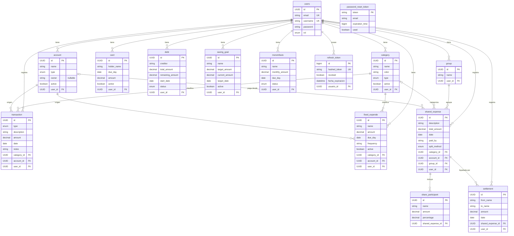

# Fintrack — Diagrama Entidad-Relación

Diagrama completo en [`er-diagram.mmd`](er-diagram.mmd) (formato Mermaid puro, listo para mermaid.live o `mmdc`).

Se renderiza también en GitHub y en VS Code con la extensión "Markdown Preview Mermaid Support".

## Diagrama completo

---

## Resumen de relaciones

| Entidad A | Cardinalidad | Entidad B | Descripción |
|-----------|--------------|-----------|-------------|
| `users` | 1—N | `account` | Un usuario tiene varias cuentas |
| `users` | 1—N | `category` | Un usuario tiene varias categorías |
| `users` | 1—N | `transaction` | Un usuario registra varias transacciones |
| `users` | 1—N | `fixed_expende` | Un usuario tiene varios gastos fijos |
| `users` | 1—N | `card` | Un usuario tiene varias tarjetas |
| `users` | 1—N | `debt` | Un usuario tiene varias deudas |
| `users` | 1—N | `saving_goal` | Un usuario tiene varias metas de ahorro |
| `users` | 1—N | `monotributo` | Un usuario tiene varios registros de monotributo |
| `users` | 1—N | `refresh_token` | Un usuario tiene varios refresh tokens |
| `category` | 1—N | `transaction` | Una categoría clasifica varias transacciones |
| `account` | 1—N | `transaction` | Una cuenta es origen de varias transacciones |
| `category` | 1—N | `fixed_expende` | Una categoría clasifica varios gastos fijos |
| `account` | 1—N | `fixed_expende` | Una cuenta debita varios gastos fijos |

> `password_reset_token` es una entidad aislada: referencia al usuario por `email` (string), sin FK a `users`.

### Planificado (Fase 1.8 — Gastos Compartidos)

| Entidad A | Cardinalidad | Entidad B | Descripción |
|-----------|--------------|-----------|-------------|
| `users` | 1—N | `shared_expense` | Un usuario registra gastos compartidos |
| `users` | 1—N | `group` | Un usuario tiene grupos de personas |
| `users` | 1—N | `settlement` | Un usuario registra liquidaciones |
| `group` | 1—N | `shared_expense` | Un grupo agrupa gastos (opcional) |
| `category` | 0—N | `shared_expense` | Categoriza un gasto compartido (opcional) |
| `account` | 0—N | `shared_expense` | Cuenta desde la que se pagó (opcional) |
| `shared_expense` | 1—N | `share_participant` | El gasto incluye N participantes |
| `shared_expense` | 1—N | `settlement` | El gasto se liquida con N pagos |

---

## Enumeraciones

| Enum | Valores |
|------|---------|
| `AccountType` | `CASH`, `WALLET`, `BANK`, `CARD` |
| `CategoryType` | `INCOME`, `EXPENSE` |
| `TransactionType` | `INCOME`, `EXPENSE` |
| `DebtStatus` | `PAID`, `ACTIVE` |
| `MonotributoStatus` | `UP_TO_DATE`, `DEBT` |
| `Rol` | `USER`, `ADMIN` |
| `SplitMethod` *(planificado)* | `EQUAL` (50/50), `PERCENTAGE`, `FIXED` |
